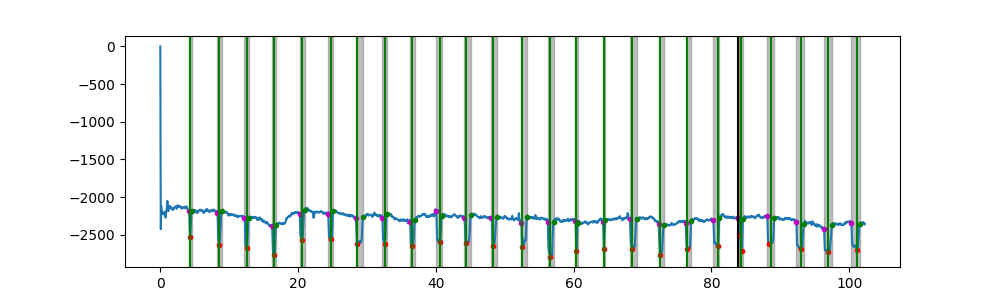

# BLINK
Codes for the paper titled, "Blink: A Fully Automated Unsupervised Algorithm for Eye Blink Detection in EEG Signals"

## Citation
------------
The dataset and codes are freely available for research use. Please cite the following publication for using the codes and dataset
<blockquote>
  <p>Mohit Agarwal, Raghupathy Sivakumar<br />
BLINK: A Fully Automated Unsupervised Algorithm for Eye-Blink Detection in EEG Signals<br />
57th Annual Allerton Conference on Communication, Control, and Computing (Allerton). IEEE, 2019.</p>
</blockquote>

## Dataset
----------
Dataset can be downloaded from [the link](http://gnan.ece.gatech.edu/eeg-eyeblinks/)

| Dataset       |  Type     | Users         | Blinks|
| ------------- |:----------|:-------------:| -----:|
| EEG-IO        |Involuntary| 20            | 500   |
| EEG-VV        |Voluntary  | 12            | 750   |
| EEG-VR        |Voluntary  | 12            | 600   |

## Codes
--------

Put `EEG-IO` or `EEG-VV` or `EEG-VR` dataset in `data/` folder, and choose the appropriate options in `blink.py`
Run `blink.py` for replicating the results presented in the paper

#### Sample Output

```
File Name:  S05_data.csv S05_labels.csv
Confusion Matrix:
[[26  0]
 [ 0 26]]
Recall, Precision, F1 Score
1.0 1.0 1.0
```

<p align="center">
  
</p>


## Contact
----------

[Mohit Agarwal](http://agmohit.com )

Email: me.agmohit@gmail.com

## References
-------------

[1] [Blink: A Fully Automated Unsupervised Algorithm for Eye Blink Detection in EEG Signals](http://gnan.ece.gatech.edu/archive/agarwal-blink.pdf)
